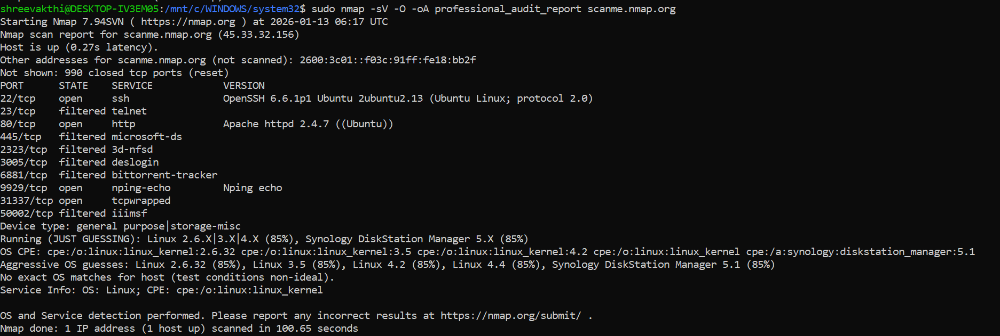

# Network Vulnerability & Attack Surface Audit

## Project Objective
This project demonstrates a professional-grade security audit. Using Nmap, I mapped the attack surface of a remote host to identify exploitable services and outdated software versions.

## Technical Evidence
* **Terminal Proof:** 
* **Raw Audit Log:** [View Scan Data](professional_audit_report.nmap)

## Critical Findings Analysis
Based on the scan conducted on Jan 13, 2026, the following vulnerabilities were identified:

| Port | Service | Finding | Risk Level |
| :--- | :--- | :--- | :--- |
| **23** | **Telnet** | Cleartext protocol detected. Vulnerable to sniffing/MITM. | **CRITICAL** |
| **80** | **Apache 2.4.7** | Outdated version. Known for multiple CVEs (Path Traversal). | **HIGH** |
| **445** | **SMB** | Filtered port. Potential entry point for lateral movement. | **MEDIUM** |

## Methodology (Cisco Defense Framework)
- **Service Versioning ($sV$):** Used to identify that Apache 2.4.7 is running, which is significantly outdated.
- **OS Fingerprinting ($O$):** Identified the target as a Linux-based environment to narrow down exploit payloads.
- **Audit Logging ($-oA$):** Generated multi-format reports for integration into a SOC workflow.

## Remediation Recommendations
1. **Immediately Disable Telnet:** Replace with SSH (Port 22) for encrypted remote access.
2. **Patch Apache:** Upgrade to the latest stable version to mitigate known web vulnerabilities.
3. **Firewall Hardening:** Ensure Port 445 (SMB) is strictly blocked from external traffic.
